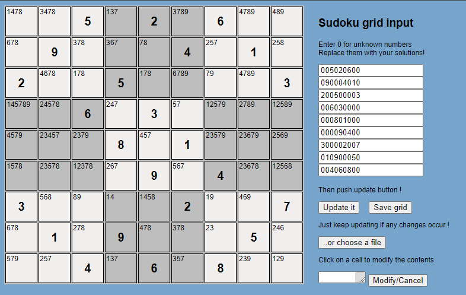
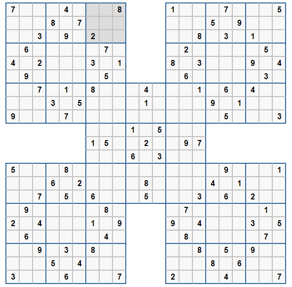

# SUDOKU SOLVING

## HTML - version 4

A grid is shown with all the candidates possible for the empty cells.

Fill the grid with the known numbers for each row, zeroes stand for empty cells.

Buttons : 

- Update will compute the grid
- Save enables to save the grid in text files
- Load a text file  to grid
- Choose a cell to edit candidates

## Python

Brute force solving 

# SAMOURAI SOLVING

Samourai grid is a 5-sudoku-grid combined into one. The rules are the same as for a simple sudoku grid but for the central grid, corners are shared with the 4 satelites.

Brute force solving
